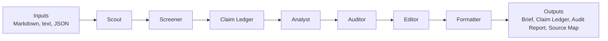

# Multi-Agent Brief Workflow

<p align="center">
  <a href="README.md">English</a> |
  <a href="README.zh-CN.md">简体中文</a>
</p>

A source-grounded, audit-ready multi-agent workflow for producing business, research, market, policy, and management briefs.

> Let code do lookup. Let models do judgment. Keep every important claim traceable.

This project turns the repeatable briefing workflow used by analysts, strategy teams, investor relations teams, research desks, and management offices into a transparent Python pipeline:

```text
Scout -> Screener -> Claim Ledger -> Analyst -> Auditor -> Editor -> Formatter
```

It is not an investment advice tool, trading signal generator, or replacement for human review.

## What Problem This Solves

Most weekly reports and executive briefs still depend on a fragile manual process: collect information, decide what matters, write analysis, verify facts, edit wording, and format the final file. That process is easy to rush, hard to audit, and difficult to reuse across teams.

This repo makes the workflow modular, inspectable, and runnable locally:

- Source-backed statements are written into a Claim Ledger before they enter the brief.
- Drafts use explicit `[src:CLAIM_ID]` citations.
- Auditors can check unsupported numbers, stale sources, duplicate claims, placeholders, and redaction risks.
- Output artifacts keep the brief, audit report, claim ledger, and source map separate.

## Why Multi-Agent Instead Of One Prompt

A real briefing process is not one job. It is a small editorial desk:

- Scout finds reportable signals.
- Screener filters and ranks candidates by novelty, source tier, and topic capacity.
- Claim Ledger records evidence.
- Analyst turns evidence into a structured draft.
- Auditor checks whether the draft is supported and distribution-ready.
- Editor improves readability without inventing new facts.
- Formatter writes the final artifacts.

Splitting these roles reduces hidden reasoning shortcuts. Each step has a narrow responsibility, and the audit trail shows where a claim came from before it reaches the final brief.

## Architecture



See [docs/architecture.md](docs/architecture.md) for the plain-language architecture guide.

## Current MVP

The first local MVP supports:

- Local `.md`, `.txt`, and `.json` inputs
- Scout agent that extracts candidate reportable items
- Screener agent that filters claims by novelty scoring, topic capacity caps, and previous-report deduplication
- Claim Ledger with source-grounded claims
- Analyst agent that drafts a Markdown brief with `[src:CLAIM_ID]` citations
- Auditor agent interface with deterministic audit and semantic-audit adapter hooks
- Deterministic Auditor for missing claims, unsupported numbers, duplicate claims, redaction risks, and stale sources
- Quality harness checks for placeholders, low-confidence sources, process residue, stale filler, and unit risks
- Editor agent that prepares the final Markdown brief
- Formatter agent that writes `brief.md`, `claim_ledger.json`, `audit_report.json`, and `source_map.md`

## Example Output

The MVP creates a Markdown brief with source citations:

```markdown
## Market

- Synthetic module price checks showed a 3.5% week-over-week decline in selected spot-market channels. [src:MARKETDA_867A7D67D0]
```

Every source-backed statement is also written to `claim_ledger.json`:

```json
{
  "claim_id": "MARKETDA_867A7D67D0",
  "statement": "Synthetic module price checks showed a 3.5% week-over-week decline in selected spot-market channels.",
  "source_id": "MARKET_DATA",
  "evidence_text": "Synthetic module price checks showed a 3.5% week-over-week decline in selected spot-market channels."
}
```

The audit report records whether the draft is distribution-ready:

```json
{
  "audit_status": "pass",
  "audit_score": 100,
  "findings": []
}
```

## Quick Start

```bash
cd multi-agent-brief-workflow
python3 -m venv .venv
source .venv/bin/activate
python -m pip install --upgrade pip
pip install -e ".[dev]"
multi-agent-brief run examples/basic_market_brief/input --output output/basic_market_brief
```

Or run from a config file:

```bash
multi-agent-brief run --config examples/basic_market_brief/config.yaml
```

The example config enables a strict weekly reporting window:

```yaml
report:
  date: "2026-06-02"
  max_source_age_days: 14
  fail_on_stale_source: true
```

When this mode is enabled, a three-month-old source cannot pass as a weekly item.

Open the generated files:

```text
output/basic_market_brief/brief.md
output/basic_market_brief/claim_ledger.json
output/basic_market_brief/audit_report.json
output/basic_market_brief/source_map.md
```

## More Examples

Run the synthetic earnings-season peer demo:

```bash
multi-agent-brief run --config examples/earnings_season_peer_demo/config.yaml
```

This demo uses only fictional peer names and synthetic source data. It is designed to show how public-safe earnings, competitor, policy, and market signals flow through the Claim Ledger and audit report.

## Example Without Install

```bash
PYTHONPATH=src python3 -m multi_agent_brief.cli.main run examples/basic_market_brief/input --output output/basic_market_brief
```

## CLI

Create a synthetic demo workspace:

```bash
multi-agent-brief init brief-demo
multi-agent-brief run --config brief-demo/config.yaml
```

Audit an existing brief:

```bash
multi-agent-brief audit output/basic_market_brief/brief.md \
  --ledger output/basic_market_brief/claim_ledger.json \
  --output output/basic_market_brief/audit_report.json
```

Print the version:

```bash
multi-agent-brief version
```

## Auditor Agent Interface

The pipeline-level `AuditorAgent` delegates to an audit backend that implements `AuditAgentInterface`.

Current audit backends:

- `DeterministicAuditAgent`: checks source IDs, unsupported numbers, duplicate claims, missing source evidence, redaction risks, and reporting-window freshness.
- `QualityHarnessAuditAgent`: ports public-safe quality gates from local workflow prototypes, including placeholders, internal process residue, `needs_recrawl`, low source density, and possible unit inflation.
- `NoOpSemanticAuditAgent`: placeholder adapter for future model-backed semantic source-support review.
- `CompositeAuditAgent`: runs deterministic audit first, then an optional semantic audit adapter.

This keeps the MVP runnable without API keys while leaving a clean interface for Claude, OpenAI, LiteLLM, or local-model audit agents.

See [docs/harness.md](docs/harness.md) for the current harness and migration backlog.

For strict final-delivery gates, see [docs/harness_matrix.md](docs/harness_matrix.md). For Codex, Claude Code subagent, and external-agent handoff patterns, see [docs/agent-collaboration.md](docs/agent-collaboration.md).

## Roadmap

- MVP: local inputs, Claim Ledger, deterministic audit, Markdown output, source map, and quality harness checks.
- Near-term: DOCX/PDF output, SEC/RSS connectors, semantic audit adapters, richer synthetic examples, and stronger documentation.
- Mid-term: industry modules, role-specific brief templates, external analysis plugins, local corpus retrieval, and source-tier policies.
- Long-term: opt-in internal message ingestion, database and semantic layer integration, multi-model routing, and enterprise deployment patterns.

See [docs/roadmap.md](docs/roadmap.md) for the detailed roadmap and [docs/repo-metadata.md](docs/repo-metadata.md) for suggested GitHub description and topics.

## Safety And Non-Investment-Advice Disclaimer

Do not commit credentials, tokens, webhooks, raw internal logs, private reports, customer names, confidential files, internal paths, or company-specific prompts. All examples in this repo should use public or synthetic data.

This project can help structure research and briefing workflows, but it does not provide legal, financial, investment, trading, or compliance advice. Human review remains required before any real-world distribution or decision-making use.

## Changelog

### v0.2.0 — Screener Agent

- Added ScreenerAgent between Scout and Analyst in the pipeline.
- Topic-based capacity caps across 10 topic buckets (max 160 claims total).
- Novelty scoring with source tier, claim type, and high-signal term weights.
- Previous report deduplication via text matching and theme-group detection.
- Stale source and low-confidence (T5) source exclusion.
- Previous report loader supporting `.md`, `.txt`, and `.docx` formats.
- Added pre-push hook and CI check: README must be updated before pushing code changes.

## Development

```bash
python3 -m pytest -q
```

## License

MIT
