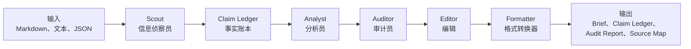

# Multi-Agent Brief Workflow

<p align="center">
  <a href="README.md">English</a> |
  <a href="README.zh-CN.md">简体中文</a>
</p>

一个基于来源、可审计的多智能体工作流，用于生成商业、研究、市场、政策和管理层简报。

> 让代码负责查找，让模型负责判断，让每一个重要结论都可以追溯来源。

本项目把分析师、战略团队、投资者关系团队、研究部门和管理层办公室常见的重复性简报生产流程，转化为一个透明的 Python 流水线：

```text
Scout -> Claim Ledger -> Analyst -> Auditor -> Editor -> Formatter
```

本项目不是投资建议工具，不是交易信号生成器，也不能替代人工审核。

## 解决什么问题

很多周报和管理层简报仍然依赖脆弱的手工流程：收集信息、判断重点、撰写分析、核验事实、编辑措辞、排版输出。这个过程很容易赶工，也很难在事后解释“这句话从哪里来”。

本仓库把这个流程拆成可检查、可复用、可本地运行的模块：

- 重要表述先进入 Claim Ledger，再进入简报。
- 简报草稿使用 `[src:CLAIM_ID]` 标注来源。
- 审计环节检查无支撑数字、过期来源、重复 claim、占位符和脱敏风险。
- 输出文件把正文、事实账本、审计报告和来源映射分开保存。

## 为什么不是一个 Prompt

真实的简报生产不是一个任务，而像一个小型编辑台：

- Scout（信息侦察员）负责发现可写入简报的信号。
- Claim Ledger（事实账本）负责记录证据。
- Analyst（分析员）把证据整理成结构化草稿。
- Auditor（审计员）检查草稿是否有来源支撑、是否适合分发。
- Editor（编辑）改善结构和表达，但不发明新事实。
- Formatter（格式转换器）输出最终文件。

把角色拆开，可以减少单个模型“顺手编”的空间。每一步职责更窄，审计轨迹也更清楚。

## 架构



详见 [docs/architecture.zh-CN.md](docs/architecture.zh-CN.md)。

## 当前 MVP

第一个本地 MVP 支持：

- 本地 `.md`、`.txt` 和 `.json` 输入
- Scout 智能体抽取候选可写入简报的事项
- Claim Ledger 记录有来源支撑的事实与判断
- Analyst 智能体用 `[src:CLAIM_ID]` 引用生成 Markdown 草稿
- Auditor 智能体接口，支持确定性审计和语义审计适配器
- Deterministic Auditor 检查缺失 claim、无支撑数字、重复 claim、脱敏风险和过期来源
- Quality Harness 检查占位符、低置信来源、流程残留文本、陈旧填充内容和单位风险
- Editor 智能体生成最终 Markdown 简报
- Formatter 智能体写出 `brief.md`、`claim_ledger.json`、`audit_report.json` 和 `source_map.md`

## 输出示例

MVP 会生成带来源引用的 Markdown 简报：

```markdown
## Market

- Synthetic module price checks showed a 3.5% week-over-week decline in selected spot-market channels. [src:MARKETDA_867A7D67D0]
```

每一条有来源支撑的表述，也会写入 `claim_ledger.json`：

```json
{
  "claim_id": "MARKETDA_867A7D67D0",
  "statement": "Synthetic module price checks showed a 3.5% week-over-week decline in selected spot-market channels.",
  "source_id": "MARKET_DATA",
  "evidence_text": "Synthetic module price checks showed a 3.5% week-over-week decline in selected spot-market channels."
}
```

审计报告会记录草稿是否已经适合分发：

```json
{
  "audit_status": "pass",
  "audit_score": 100,
  "findings": []
}
```

## 快速开始

```bash
cd multi-agent-brief-workflow
python3 -m venv .venv
source .venv/bin/activate
python -m pip install --upgrade pip
pip install -e ".[dev]"
multi-agent-brief run examples/basic_market_brief/input --output output/basic_market_brief
```

也可以通过配置文件运行：

```bash
multi-agent-brief run --config examples/basic_market_brief/config.yaml
```

示例配置启用了严格的周报时间窗口：

```yaml
report:
  date: "2026-06-02"
  max_source_age_days: 14
  fail_on_stale_source: true
```

启用该模式后，三个月前的来源不能作为本周事项通过审计。

查看生成文件：

```text
output/basic_market_brief/brief.md
output/basic_market_brief/claim_ledger.json
output/basic_market_brief/audit_report.json
output/basic_market_brief/source_map.md
```

## 更多示例

运行合成的 earnings-season peer demo：

```bash
multi-agent-brief run --config examples/earnings_season_peer_demo/config.yaml
```

这个 demo 只使用虚构同行名称和合成来源数据，用来展示 earnings、competitor、policy 和 market 信号如何进入 Claim Ledger 与审计报告。

## 不安装也可以运行

```bash
PYTHONPATH=src python3 -m multi_agent_brief.cli.main run examples/basic_market_brief/input --output output/basic_market_brief
```

## CLI

创建一个合成 demo 工作区：

```bash
multi-agent-brief init brief-demo
multi-agent-brief run --config brief-demo/config.yaml
```

审计已有简报：

```bash
multi-agent-brief audit output/basic_market_brief/brief.md \
  --ledger output/basic_market_brief/claim_ledger.json \
  --output output/basic_market_brief/audit_report.json
```

打印版本号：

```bash
multi-agent-brief version
```

## Auditor Agent Interface

流水线层面的 `AuditorAgent` 会委托给实现了 `AuditAgentInterface` 的审计后端。

当前审计后端包括：

- `DeterministicAuditAgent`：检查 source ID、无支撑数字、重复 claim、缺失来源证据、脱敏风险和报告时间窗口内的来源新鲜度。
- `QualityHarnessAuditAgent`：迁移自本地 workflow prototype 的公开安全质量门控，包括占位符、内部流程残留文本、`needs_recrawl`、低来源密度和潜在单位膨胀风险。
- `NoOpSemanticAuditAgent`：为未来基于模型的语义来源支撑审查预留的占位适配器。
- `CompositeAuditAgent`：先运行确定性审计，再运行可选的语义审计适配器。

这样可以让 MVP 在没有 API key 的情况下运行，同时为 Claude、OpenAI、LiteLLM 或本地模型审计智能体保留干净接口。

详见 [docs/harness.md](docs/harness.md)。

## 路线图

- MVP：本地输入、Claim Ledger、确定性审计、Markdown 输出、来源映射和质量门控。
- 近期：DOCX/PDF 输出、SEC/RSS 连接器、语义审计适配器、更完整的合成示例和文档。
- 中期：行业模块、角色化简报模板、外部分析插件、本地语料检索和来源分级策略。
- 长期：可选的内部消息接入、数据库与语义层集成、多模型路由和企业部署模式。

详见 [docs/roadmap.zh-CN.md](docs/roadmap.zh-CN.md)。

## 安全与非投资建议声明

不要提交凭证、token、webhook、原始内部日志、私有报告、客户名称、机密文件、内部路径或公司特定 prompt。本仓库中的所有示例都应使用公开数据或合成数据。

本项目可以帮助组织研究和简报流程，但不提供法律、金融、投资、交易或合规建议。任何真实分发或决策使用前，都需要人工审核。

## 开发

```bash
python3 -m pytest -q
```

## 许可证

MIT
