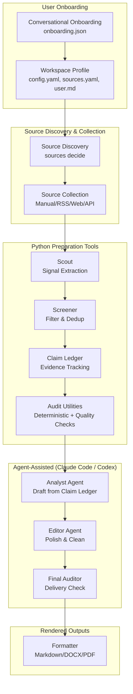

# Multi-Agent Brief Workflow Toolkit

<p align="center">
  <a href="README_en.md">English</a> |
  <a href="README.md">简体中文</a>
</p>

A source-grounded, audit-ready agent-orchestrated workflow toolkit for producing business, research, market, policy, and management briefs.

> Let code do lookup. Let models do judgment. Keep every important claim traceable.

This project provides workspace initialization, source discovery, source collection, Claim Ledger/audit utilities, document rendering, and Claude/Codex agent workflow support. The final brief is written by Claude Code / Codex / external LLM agents using Claim Ledger and audit outputs.

```text
Onboarding → Workspace Profile → Source Discovery → Source Collection → Claim Ledger/audit → Agent-assisted Drafting → Final Audit → Rendered Outputs
```

It is not an investment advice tool, trading signal generator, or replacement for human review.

## What Problem This Solves

Most weekly reports and executive briefs still depend on a fragile manual process: collect information, decide what matters, write analysis, verify facts, edit wording, and format the final file. That process is easy to rush, hard to audit, and difficult to reuse across teams.

This repo provides a toolkit that makes the workflow modular, inspectable, and runnable locally:

- Python tools handle source collection, signal filtering, evidence tracking, and audit checks.
- Claude/Codex agents write the final brief from the Claim Ledger.
- Draft and audited Markdown use explicit `[src:CLAIM_ID]` citations; the reader-facing `brief.md` strips those internal IDs.
- Auditors check unsupported numbers, stale sources, duplicate claims, placeholders, and redaction risks.
- Output artifacts keep the draft brief, audit report, claim ledger, and source map separate.

## Project Motivation

This project is an open-source workflow for producing leadership briefs, weekly reports, research notes, market updates, and policy briefings used in corporate strategy teams, securities research, funds, investor relations, management offices, and research desks.

In many organizations, interns, management trainees, and junior analysts spend a large amount of time preparing daily, weekly, and monthly reports. The work is important, but the process is often repetitive: collecting sources, filtering what matters, removing stale or duplicate signals, drafting analysis, checking facts, editing wording, and formatting the final document.

This project turns that workflow into a source-grounded, audit-ready, agent-orchestrated toolkit:

```text
Onboarding → Source Discovery → Source Collection → Claim Ledger/audit → Agent-assisted Drafting → Final Audit → Rendered Outputs
```

It does not replace human judgment and does not provide investment advice. Instead, it helps structure repetitive briefing work so people can spend more time on analysis, discussion, and decision support.

The core principle is:

> Let code do lookup. Let models do judgment. Keep every important claim traceable.

## Why Multi-Agent Instead Of One Prompt

A real briefing process is not one job. It is a small editorial desk:

- **Python preparation tools** handle source collection, signal filtering, evidence tracking, and audit checks.
- **Claude/Codex agents** handle analysis writing, editing, and final delivery audit.
- **Rendering tools** handle Markdown, DOCX, and other output formats.

Splitting these roles reduces hidden reasoning shortcuts. Python tools handle deterministic tasks, agents handle tasks requiring judgment, and the audit trail shows where every claim came from.

## Architecture



See [docs/architecture.md](docs/architecture.md) for the plain-language architecture guide.

## Current Features

This project provides the following tools and capabilities:

**Workspace & Onboarding:**
- `multi-agent-brief init` creates a reusable brief workspace
- `multi-agent-brief init --from-onboarding onboarding.json` supports conversational onboarding initialization
- Onboarding mapper auto-translates Chinese role, industry, and audience labels into English config values

**Source Discovery & Collection:**
- `multi-agent-brief sources decide` subcommand resolves `llm_decide` source policy into concrete candidates, with `--merge` to merge back into `sources.yaml`
- Supports manual files, RSS, web search, API, SEC filings, MCP, CLI source providers
- `multi-agent-brief doctor` checks source configuration health

**Preparation Tools (Python Deterministic Pipeline):**
- Scout agent extracts candidate reportable items
- Screener agent filters claims by novelty scoring, topic capacity caps, and previous-report deduplication
- Claim Ledger records source-grounded evidence
- Deterministic audit checks missing claims, unsupported numbers, duplicate claims, redaction risks, and stale sources
- Quality harness checks for placeholders, low-confidence sources, process residue, stale filler, and unit risks
- `/generate-brief <workspace>` in Claude Code orchestrates the full subagent workflow (analyst → editor → auditor → formatter) to produce `output/brief.md`, `claim_ledger.json`, `audit_report.json`, `source_map.md`

**Agent-Assisted (Claude Code / Codex):**
- Claude Code subagents (analyst, editor, auditor) write the final brief from Claim Ledger
- `/generate-brief` slash command orchestrates the full agent workflow
- Codex agent and skill configs auto-generated

**Rendering & Output:**
- DOCX renderer (enabled by default)
- Stable `brief.md` / `brief.docx` outputs plus automatically named delivery copies from `output.filename_template`
- `python scripts/check_terms.py` terminology consistency checker prevents spelling drift

## Example Output

The preparation tools create a Markdown draft with source citations:

```markdown
## Market

- Synthetic module price checks showed a 3.5% week-over-week decline in selected spot-market channels. [src:MARKETDA_867A7D67D0]
```

Every source-backed statement is also written to `claim_ledger.json`:

```json
{
  "claim_id": "MARKETDA_867A7D67D0",
  "statement": "Synthetic module price checks showed a 3.5% week-over-week decline in selected spot-market channels.",
  "source_id": "MARKET_DATA",
  "evidence_text": "Synthetic module price checks showed a 3.5% week-over-week decline in selected spot-market channels."
}
```

The audit report records whether the draft is distribution-ready:

```json
{
  "audit_status": "pass",
  "audit_score": 100,
  "findings": []
}
```

## Getting Started (for Humans)

Open your Claude Code or Codex, and type:

```text
Clone https://github.com/Stahl-G/multi-agent-brief-workflow and start the interactive onboarding initialization
```

Then follow the prompts. The agent must ask plain-language onboarding questions before creating a workspace.

For web search, register at [tavily.com](https://tavily.com) to get a Tavily API key, then set it:

```bash
export TAVILY_API_KEY=<your-key>
```

Other search backends (Exa, Brave, Firecrawl, Serper) are also supported. See [docs/search-backends.md](docs/search-backends.md) for details.

---

## Quick Start (Developer / Manual)

macOS / Linux / WSL:

```bash
git clone https://github.com/Stahl-G/multi-agent-brief-workflow.git
cd multi-agent-brief-workflow
bash scripts/setup.sh
source .venv/bin/activate

# 1. Init workspace via interactive onboarding
multi-agent-brief init ../mabw-workspace

# 2. Add source files
echo "- Industry news summary" > ../mabw-workspace/input/news.md

# 3. Check config
multi-agent-brief doctor --config ../mabw-workspace/config.yaml

# 4. Generate brief via Claude Code or Codex subagents:
#    /generate-brief ../mabw-workspace
#    Or manually step through: analyst → editor → auditor → formatter

# View output
cat ../mabw-workspace/output/brief.md
# Audit-ready version with claim IDs:
cat ../mabw-workspace/output/intermediate/audited_brief.md
```

> **Note:** Use `/generate-brief <workspace>` in Claude Code for the full subagent workflow (analyst → editor → auditor → formatter). The Python CLI no longer runs the brief generation pipeline. See [docs/claude-code-workflow.md](docs/claude-code-workflow.md).

Windows 10/11 should use native PowerShell 5.1 or PowerShell 7. WSL/Git Bash is optional, not required. CMD is not the primary support target.

```powershell
git clone https://github.com/Stahl-G/multi-agent-brief-workflow.git
cd multi-agent-brief-workflow
.\scripts\setup.ps1
.\.venv\Scripts\Activate.ps1

multi-agent-brief init ../mabw-workspace
echo "- Industry news summary" > ../mabw-workspace\input\news.md
multi-agent-brief doctor --config ../mabw-workspace\config.yaml
# Then: /generate-brief ../mabw-workspace in Claude Code
```

You can also use the built-in example for a quick check:

```bash
# Example: /generate-brief examples/basic_market_brief in Claude Code
```

The example config enables a strict weekly reporting window:

```yaml
report:
  date: "2026-06-02"
  max_source_age_days: 14
  fail_on_stale_source: true
```

When this mode is enabled, a three-month-old source cannot pass as a weekly item.

Open the generated files:

```text
output/basic_market_brief/brief.md
output/basic_market_brief/intermediate/audited_brief.md
output/basic_market_brief/intermediate/claim_ledger.json
output/basic_market_brief/intermediate/audit_report.json
output/basic_market_brief/intermediate/source_map.md
```

## More Examples

Run the synthetic earnings-season peer demo:

```bash
# Use /generate-brief in Claude Code for the demo workspace
```

PowerShell:

```powershell
# Use /generate-brief in Claude Code for the demo workspace
```

This demo uses only fictional peer names and synthetic source data. It is designed to show how public-safe earnings, competitor, policy, and market signals flow through the Claim Ledger and audit report.

## Example Without Install

macOS / Linux / WSL:

```bash
PYTHONPATH=src python -m multi_agent_brief.cli.main run examples/basic_market_brief/input --output output/basic_market_brief
```

PowerShell:

```powershell
$env:PYTHONPATH = "src"
python -m multi_agent_brief.cli.main run examples/basic_market_brief/input --output output/basic_market_brief
Remove-Item Env:PYTHONPATH
```

## llm_decide Source Discovery

The default `llm_decide` source mode lets the agent automatically generate search intents and candidate sources based on `user.md`:

```bash
# 1. Init through interactive onboarding
multi-agent-brief init ../mabw-workspace

# 2. Generate candidate sources (template mode, no API key needed)
multi-agent-brief sources decide --config ../mabw-workspace/config.yaml

# 3. Review candidates
cat ../mabw-workspace/source_candidates.yaml

# 4. Merge into sources
multi-agent-brief sources decide --config ../mabw-workspace/config.yaml --merge

# 5. Run pipeline
multi-agent-brief sources decide --config ../mabw-workspace/config.yaml
# Then /generate-brief ../mabw-workspace in Claude Code
```

The llm_decide mode does not block pipeline execution — if you skip `sources decide`, the pipeline continues with local `input/` files and prints a warning.

## DOCX Output

When initializing a workspace, the default output formats now include `docx`. After running the pipeline, both `brief.md` and `brief.docx` will appear in the `output/` directory.

The formatter also writes human-readable named delivery copies. The default template is:

```yaml
output:
  filename_template: "{project_name}_{report_date}"
  named_outputs: true
```

DOCX requires the `python-docx` dependency. It is included when installing with `.[dev]`:

```bash
pip install -e ".[dev]"
```

Or install separately:

```bash
pip install "multi-agent-brief-workflow[docx]"
```

The DOCX uses a professional investment-bank-style layout with heading hierarchy, tables, lists, blockquotes, and code blocks. The default footer is "Confidential — Internal Use Only" — customize via `output.footer` in `config.yaml`.

If `python-docx` is not installed, the pipeline continues without interruption but records `docx_generation: skipped_missing_dependency` in `output/intermediate/audit_report.json`.

## Feishu / Lark Integration

Bidirectional Feishu integration via the official [lark-cli](https://github.com/larksuite/cli) tool. Use Feishu Docs, meeting minutes, Base tables, sheets, calendar, and approval tasks as source inputs, or deliver generated briefs to Feishu chats, docs, and Drive.

### Install lark-cli

```bash
npx @larksuite/cli@latest install      # install
lark-cli config init                    # configure app credentials
lark-cli auth login --recommend         # log in with recommended scopes
lark-cli auth status                    # verify
```

### Source (input)

Add to `sources.yaml`:

```yaml
feishu:
  enabled: true
  sources:
    - name: "meeting-notes"
      token: "..."            # from feishu doc URL
      type: minutes           # doc | minutes | base | sheet | agenda | approval
```

### Delivery (output)

Send briefs from Python:

```python
from multi_agent_brief.delivery.feishu import FeishuDeliveryConnector
from multi_agent_brief.delivery.base import DeliveryArtifact, DeliveryTarget

FeishuDeliveryConnector().deliver(
    DeliveryArtifact(path="output/brief.md", title="Weekly Brief"),
    DeliveryTarget(channel="chat", recipient="oc_your_chat_id"),
)
```

See [docs/feishu-integration.md](docs/feishu-integration.md) for full details.

## CLI

### Enable Tavily Live Search

Web search is disabled by default. To enable it:

You can opt in during `init` (the interactive wizard asks), or manually edit `sources.yaml`:

```yaml
web_search:
  enabled: true
  backend: tavily
  api_key_env: TAVILY_API_KEY
  topic: news
  search_depth: basic
  max_results: 5
  search_tasks:
    - query: "manufacturing tariff trade policy"
      domains:
        - "reuters.com"
        - "bloomberg.com"
```

2. Set the environment variable and run:

```bash
export TAVILY_API_KEY=tvly-your-key-here
multi-agent-brief sources decide --config ../mabw-workspace/config.yaml
# Then /generate-brief ../mabw-workspace in Claude Code
```

PowerShell:

```powershell
$env:TAVILY_API_KEY = Read-Host "Enter your Tavily API key"
multi-agent-brief sources decide --config ../mabw-workspace/config.yaml
# Then /generate-brief ../mabw-workspace in Claude Code
```

3. Check configuration health:

```bash
multi-agent-brief doctor --config ../mabw-workspace/config.yaml
```

Notes:
- Web search is disabled by default and must be explicitly enabled
- Tavily requires `TAVILY_API_KEY` environment variable
- API keys must be stored in environment variables, not config files
- API keys are never printed or stored in configuration
- If Tavily is enabled but the API key is missing, the pipeline fails immediately (fail-fast)
- Web search results may not provide reliable `published_at` dates — time-sensitive web_search claims should be manually verified
- Web search ingestion includes boilerplate filtering (cookies, privacy policy, TOC, etc.) but is not perfect
- Real-time search feature is not release-ready until live smoke passes

Create a synthetic demo workspace:

```bash
multi-agent-brief init ../mabw-workspace --demo
multi-agent-brief sources decide --config ../mabw-workspace/config.yaml
# Then /generate-brief ../mabw-workspace in Claude Code
```

PowerShell:

```powershell
multi-agent-brief init ../mabw-workspace --demo
multi-agent-brief sources decide --config ../mabw-workspace/config.yaml
# Then /generate-brief ../mabw-workspace in Claude Code
```

Audit an existing brief:

```bash
multi-agent-brief audit output/basic_market_brief/intermediate/audited_brief.md \
  --ledger output/basic_market_brief/intermediate/claim_ledger.json \
  --output output/basic_market_brief/intermediate/audit_report.json
```

PowerShell:

```powershell
multi-agent-brief audit output/basic_market_brief/intermediate/audited_brief.md `
  --ledger output/basic_market_brief/intermediate/claim_ledger.json `
  --output output/basic_market_brief/intermediate/audit_report.json
```

Print the version:

```bash
multi-agent-brief version
```

## Auditor Agent Interface

The pipeline-level `AuditorAgent` delegates to an audit backend that implements `AuditAgentInterface`.

Current audit backends:

- `DeterministicAuditAgent`: checks source IDs, unsupported numbers, duplicate claims, missing source evidence, redaction risks, and reporting-window freshness.
- `QualityHarnessAuditAgent`: ports public-safe quality gates from local workflow prototypes, including placeholders, internal process residue, `needs_recrawl`, low source density, and possible unit inflation.
- `NoOpSemanticAuditAgent`: placeholder adapter for future model-backed semantic source-support review.
- `CompositeAuditAgent`: runs deterministic audit first, then an optional semantic audit adapter.

This keeps the MVP runnable without API keys while leaving a clean interface for Claude, OpenAI, LiteLLM, or local-model audit agents.

See [docs/harness.md](docs/harness.md) for the current harness and migration backlog.

For strict final-delivery gates, see [docs/harness_matrix.md](docs/harness_matrix.md). For Codex, Claude Code subagent, and external-agent handoff patterns, see [docs/agent-collaboration.md](docs/agent-collaboration.md).

## Agent Support

This repository can generate Codex and Claude Code agent configurations from a single role manifest.

- `configs/agent_roles.yaml` is the source of truth.
- `scripts/generate_agent_configs.py` generates platform-specific files.
- `AGENTS.md` provides project-level instructions for Codex and other coding agents.
- `.agents/skills/*/SKILL.md` provides Codex-compatible skills.
- `.codex/agents/*.toml` provides Codex custom agents.
- `.claude/agents/*.md` provides Claude Code subagents.
- `docs/agents/` documents platform adaptation and harness subagents.

Regenerate configs:

```bash
python scripts/generate_agent_configs.py --write
```

PowerShell:

```powershell
python scripts/generate_agent_configs.py --write
```

Check generated files:

```bash
python scripts/generate_agent_configs.py --check
```

PowerShell:

```powershell
python scripts/generate_agent_configs.py --check
```

See [docs/windows-powershell.md](docs/windows-powershell.md) for native Windows setup. WSL is optional, not required.

## Claude Code Agent Mode

This repository supports a Claude Code subagent orchestration layer for interactive source planning, claim extraction, analysis, and editing.

**Important:** The Python CLI does not automatically spawn Claude Code subagents. In Claude Code, use `/generate-brief <workspace>` or ask Claude Code to run the subagent-assisted workflow. The subagents are prompt-layer orchestration, not Python SDK calls.

### Two-Layer Architecture

| Layer | Purpose | Characteristics |
|-------|---------|-----------------|
| Python CLI | Deterministic pipeline execution, audit, output | Testable, no API keys required |
| Claude Code subagents | Interactive source planning, extraction, analysis, editing | Model-assisted judgment |

The two layers complement each other. The Python CLI is the source of truth for pipeline logic and audit gates.

### Available Subagents

Subagent definitions live in `.claude/agents/`:

| Subagent | Purpose |
|----------|---------|
| `source-planner` | Generate/refine source candidates and search tasks |
| `scout` | Extract candidate reportable items from sources |
| `analyst` | Draft management-ready brief sections |
| `editor` | Improve readability without adding facts |
| `auditor` | Review final brief against ledger and audit report |

### Usage Examples

```text
# Source planning
"Use the source-planner subagent to create sources for the workspace at ../mabw-workspace."

# Claim extraction
"Use the scout subagent to extract claims from the latest search results."

# Run pipeline
multi-agent-brief sources decide --config ../mabw-workspace/config.yaml
# Then /generate-brief ../mabw-workspace in Claude Code

# Analyst improvement
"Use the analyst subagent to improve the brief while preserving citations."

# Auditor review
"Use the auditor subagent to verify the final output."
```

See [docs/claude-code-workflow.md](docs/claude-code-workflow.md) and [docs/claude-code-quickstart.md](docs/claude-code-quickstart.md).

## Roadmap

- MVP: local inputs, Claim Ledger, deterministic audit, Markdown output, source map, and quality harness checks.
- Near-term: PDF output, SEC/RSS connectors, semantic audit adapters, richer synthetic examples, and stronger documentation.
- Mid-term: industry modules, role-specific brief templates, external analysis plugins, local corpus retrieval, and source-tier policies.
- Long-term: opt-in internal message ingestion, database and semantic layer integration, multi-model routing, and enterprise deployment patterns.

See [docs/roadmap.md](docs/roadmap.md) for the detailed roadmap and [docs/repo-metadata.md](docs/repo-metadata.md) for suggested GitHub description and topics.

## Safety And Non-Investment-Advice Disclaimer

Do not commit credentials, tokens, webhooks, raw internal logs, private reports, customer names, confidential files, internal paths, or company-specific prompts. All examples in this repo should use public or synthetic data.

This project can help structure research and briefing workflows, but it does not provide legal, financial, investment, trading, or compliance advice. Human review remains required before any real-world distribution or decision-making use.

## Changelog

See [CHANGELOG.md](CHANGELOG.md) for the full version history.

Current version: **v0.1.1** — Source layer completion: 4 stub providers now functional

Previously `api_news`, `api_filings` (SEC EDGAR), `mcp_provider`, and `cli_provider`
were empty interfaces — enabling them silently returned 0 results.
v0.1.1 fills all four with working implementations:

| Provider | What it does now |
|----------|-----------------|
| **NewsAPI** | Search news by keyword, date range, language, and source domains; returns structured article items |
| **SEC EDGAR** | Input company name or ticker, auto-resolve CIK, fetch recent 10-K/10-Q/8-K filings |
| **MCP Protocol** | Connect to local MCP servers over stdio JSON-RPC 2.0, discover and execute tools |
| **CLI Scripts** | Run local shell commands, auto-parse JSON arrays or plain text output as source items |

All implementations use Python stdlib only (urllib / subprocess) — zero additional dependencies.

**Latest unreleased: Agent onboarding hardening — remove sensible defaults**

Previously, agent instructions allowed "choose sensible defaults" when the user said
"default" / "unknown". This meant trivial requests like "start" would skip onboarding
and create a workspace with incorrect settings.

This fix:
- Removed all "choose sensible defaults" language from agent instructions; replaced with:
  "Do not infer or silently choose onboarding values."
- Deleted sentinel→default mapping from all 6 `normalize_*` functions in `onboarding/mapper.py`
  ("default" no longer becomes en-US, "Sample Company", etc.)
- `multi-agent-brief init --from-onboarding` now validates company/industry/title are
  non-empty and fails with a clear error if missing
- Generic requests like "start", "run", "initialize" no longer trigger default values

[View full changelog →](CHANGELOG.md)

## Development

```bash
python -m pytest -q
```

PowerShell:

```powershell
python -m pytest -q
```

## Contributing

This project is currently maintained mainly by one person and is still at an early stage.

Contributions, issues, discussions, and trial feedback are welcome, especially from people who have worked on weekly reports, management briefs, research notes, market updates, policy briefings, internal reporting workflows, or AI-assisted office work.

The project needs feedback from different industries, roles, and career stages to become useful in real-world workflows.

Useful contributions include:

* real briefing scenarios;
* pain points from weekly, monthly, or daily reporting work;
* industry-specific report structures;
* role-specific templates for strategy, investment, IR, legal, compliance, or management teams;
* suggestions for Source Providers, Screener logic, Claim Ledger design, or audit checks;
* synthetic examples and public-safe demos;
* documentation, tests, and safety improvements.

Even a single issue describing a real workflow, a template suggestion, or a failure case can help make the project more useful.

## License

MIT

## Interactive Onboarding Questions

The initialization wizard asks the following 10 questions:

1. **Monitor Content** - What should this brief monitor?
   - Default: company + industry + policy + competitors + risk events

2. **Target Audience** - Who will read this brief?
   - Default: management / leadership team

3. **Source Breadth** - How broad should sources be?
   - Default: reliable public sources + industry media

4. **Language and Cadence** - What language and frequency?
   - Default: English, weekly

5. **Focus Areas** - What specific areas are most important?
   - Examples: sales data, autonomous driving, policy, supply chain, product launches

6. **Search Backend** ⭐ - Choose web search provider
   - tavily (default, fast AI search)
   - exa (deep research)
   - brave (independent web index)
   - firecrawl (search + scrape)
   - serper (Google SERP)
   - serpapi (broad SERP)
   - none (local files only)

7. **Items Per Brief** - How many items per brief?
   - Default: 8 items

8. **Source Age Limit** - Maximum age for source materials (days)?
   - Default: 14 days

9. **Audit Strictness** - How strict should the audit be?
   - standard (default)
   - strict (fail on any issue)
   - lenient (allow minor issues)

10. **Forbidden Sources** - Any sources or topics to avoid?
    - Default: none
