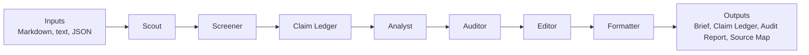

# Multi-Agent Brief Workflow

<p align="center">
  <a href="README_en.md">English</a> |
  <a href="README.md">简体中文</a>
</p>

A source-grounded, audit-ready multi-agent workflow for producing business, research, market, policy, and management briefs.

> Let code do lookup. Let models do judgment. Keep every important claim traceable.

This project turns the repeatable briefing workflow used by analysts, strategy teams, investor relations teams, research desks, and management offices into a transparent Python pipeline:

```text
Scout -> Screener -> Claim Ledger -> Analyst -> Auditor -> Editor -> Formatter
```

It is not an investment advice tool, trading signal generator, or replacement for human review.

## What Problem This Solves

Most weekly reports and executive briefs still depend on a fragile manual process: collect information, decide what matters, write analysis, verify facts, edit wording, and format the final file. That process is easy to rush, hard to audit, and difficult to reuse across teams.

This repo makes the workflow modular, inspectable, and runnable locally:

- Source-backed statements are written into a Claim Ledger before they enter the brief.
- Drafts use explicit `[src:CLAIM_ID]` citations.
- Auditors can check unsupported numbers, stale sources, duplicate claims, placeholders, and redaction risks.
- Output artifacts keep the brief, audit report, claim ledger, and source map separate.

## Project Motivation

This project is an open-source workflow for producing leadership briefs, weekly reports, research notes, market updates, and policy briefings used in corporate strategy teams, securities research, funds, investor relations, management offices, and research desks.

In many organizations, interns, management trainees, and junior analysts spend a large amount of time preparing daily, weekly, and monthly reports. The work is important, but the process is often repetitive: collecting sources, filtering what matters, removing stale or duplicate signals, drafting analysis, checking facts, editing wording, and formatting the final document.

This project turns that workflow into a source-grounded, audit-ready, multi-agent pipeline:

```text
Source Providers -> Scout -> Screener -> Claim Ledger -> Analyst -> Auditor -> Editor -> Formatter
```

It does not replace human judgment and does not provide investment advice. Instead, it helps structure repetitive briefing work so people can spend more time on analysis, discussion, and decision support.

The core principle is:

> Let code do lookup. Let models do judgment. Keep every important claim traceable.

## Why Multi-Agent Instead Of One Prompt

A real briefing process is not one job. It is a small editorial desk:

- Scout finds reportable signals.
- Screener filters and ranks candidates by novelty, source tier, and topic capacity.
- Claim Ledger records evidence.
- Analyst turns evidence into a structured draft.
- Auditor checks whether the draft is supported and distribution-ready.
- Editor improves readability without inventing new facts.
- Formatter writes the final artifacts.

Splitting these roles reduces hidden reasoning shortcuts. Each step has a narrow responsibility, and the audit trail shows where a claim came from before it reaches the final brief.

## Architecture



See [docs/architecture.md](docs/architecture.md) for the plain-language architecture guide.

## Current MVP

The first local MVP supports:

- Local `.md`, `.txt`, and `.json` inputs
- Scout agent that extracts candidate reportable items
- Screener agent that filters claims by novelty scoring, topic capacity caps, and previous-report deduplication
- Claim Ledger with source-grounded claims
- Analyst agent that drafts a Markdown brief with `[src:CLAIM_ID]` citations
- Auditor agent interface with deterministic audit and semantic-audit adapter hooks
- Deterministic Auditor for missing claims, unsupported numbers, duplicate claims, redaction risks, and stale sources
- Quality harness checks for placeholders, low-confidence sources, process residue, stale filler, and unit risks
- Editor agent that prepares the final Markdown brief
- Formatter agent that writes `brief.md`, `claim_ledger.json`, `audit_report.json`, and `source_map.md`
- `multi-agent-brief sources decide` subcommand resolves `llm_decide` source policy into concrete candidates, with `--merge` to merge back into `sources.yaml`
- `multi-agent-brief init --from-onboarding onboarding.json` supports conversational onboarding initialization
- Onboarding mapper auto-translates Chinese role, industry, and audience labels into English config values
- `python scripts/public_safe_scan.py` public-safe content scanner detects personal info and sensitive content leaks in public files
- `python scripts/check_terms.py` terminology consistency checker prevents spelling drift
- Manual source path resolution: relative paths in `sources.yaml` are resolved against the config file's parent directory, enabling workspaces outside the repo
- `report.date: auto` automatically generates the report date using today's date

## Example Output

The MVP creates a Markdown brief with source citations:

```markdown
## Market

- Synthetic module price checks showed a 3.5% week-over-week decline in selected spot-market channels. [src:MARKETDA_867A7D67D0]
```

Every source-backed statement is also written to `claim_ledger.json`:

```json
{
  "claim_id": "MARKETDA_867A7D67D0",
  "statement": "Synthetic module price checks showed a 3.5% week-over-week decline in selected spot-market channels.",
  "source_id": "MARKET_DATA",
  "evidence_text": "Synthetic module price checks showed a 3.5% week-over-week decline in selected spot-market channels."
}
```

The audit report records whether the draft is distribution-ready:

```json
{
  "audit_status": "pass",
  "audit_score": 100,
  "findings": []
}
```

## Quick Start

macOS / Linux / WSL:

```bash
git clone https://github.com/ORG/multi-agent-brief-workflow.git
cd multi-agent-brief-workflow
bash scripts/setup.sh
source .venv/bin/activate

# 1. Init workspace
multi-agent-brief init my-workspace --language en-US --company "Company Name" --industry manufacturing --title "Weekly Brief" --audience management

# 2. Add source files
echo "- Industry news summary" > my-workspace/input/news.md

# 3. Check config
multi-agent-brief doctor --config my-workspace/config.yaml

# 4. Run pipeline
multi-agent-brief run --config my-workspace/config.yaml

# View output
cat my-workspace/output/brief.md
```

Windows 10/11 should use native PowerShell 5.1 or PowerShell 7. WSL/Git Bash is optional, not required. CMD is not the primary support target.

```powershell
git clone https://github.com/ORG/multi-agent-brief-workflow.git
cd multi-agent-brief-workflow
.\scripts\setup.ps1
.\.venv\Scripts\Activate.ps1

multi-agent-brief init my-workspace --language en-US --company "Company Name" --industry manufacturing --title "Weekly Brief" --audience management
echo "- Industry news summary" > my-workspace\input\news.md
multi-agent-brief doctor --config my-workspace\config.yaml
multi-agent-brief run --config my-workspace\config.yaml
```

You can also use the built-in example for a quick check:

```bash
multi-agent-brief run examples/basic_market_brief/input --output output/basic_market_brief
```

The example config enables a strict weekly reporting window:

```yaml
report:
  date: "2026-06-02"
  max_source_age_days: 14
  fail_on_stale_source: true
```

When this mode is enabled, a three-month-old source cannot pass as a weekly item.

Open the generated files:

```text
output/basic_market_brief/brief.md
output/basic_market_brief/claim_ledger.json
output/basic_market_brief/audit_report.json
output/basic_market_brief/source_map.md
```

## More Examples

Run the synthetic earnings-season peer demo:

```bash
multi-agent-brief run --config examples/earnings_season_peer_demo/config.yaml
```

PowerShell:

```powershell
multi-agent-brief run --config examples/earnings_season_peer_demo/config.yaml
```

This demo uses only fictional peer names and synthetic source data. It is designed to show how public-safe earnings, competitor, policy, and market signals flow through the Claim Ledger and audit report.

## Example Without Install

macOS / Linux / WSL:

```bash
PYTHONPATH=src python -m multi_agent_brief.cli.main run examples/basic_market_brief/input --output output/basic_market_brief
```

PowerShell:

```powershell
$env:PYTHONPATH = "src"
python -m multi_agent_brief.cli.main run examples/basic_market_brief/input --output output/basic_market_brief
Remove-Item Env:PYTHONPATH
```

## llm_decide Source Discovery

The default `llm_decide` source mode lets the agent automatically generate search intents and candidate sources based on `user.md`:

```bash
# 1. Init with llm_decide
multi-agent-brief init my-workspace --language en-US --company "Company" --industry manufacturing --source-profile llm_decide

# 2. Generate candidate sources (template mode, no API key needed)
multi-agent-brief sources decide --config my-workspace/config.yaml

# 3. Review candidates
cat my-workspace/source_candidates.yaml

# 4. Merge into sources
multi-agent-brief sources decide --config my-workspace/config.yaml --merge

# 5. Run pipeline
multi-agent-brief run --config my-workspace/config.yaml
```

The llm_decide mode does not block pipeline execution — if you skip `sources decide`, the pipeline continues with local `input/` files and prints a warning.

## Enable DOCX Output

The pipeline generates Markdown by default. To also produce a styled Word document (`brief.docx`):

```bash
pip install "multi-agent-brief-workflow[docx]"
```

Add `docx` to the output formats in your workspace `config.yaml`:

```yaml
output:
  path: "output"
  formats:
    - "markdown"
    - "docx"
  footer: "Confidential — Internal Use Only"  # optional custom footer
```

After running, both `brief.md` and `brief.docx` will appear in the `output/` directory. The DOCX uses a professional investment-bank-style layout with heading hierarchy, tables, lists, blockquotes, and code blocks.

PowerShell:

```powershell
pip install "multi-agent-brief-workflow[docx]"
```

## CLI

### Enable Tavily Live Search

Web search is disabled by default. To enable it:

You can opt in during `init` (the interactive wizard asks), or manually edit `sources.yaml`:

```yaml
web_search:
  enabled: true
  backend: tavily
  api_key_env: TAVILY_API_KEY
  topic: news
  search_depth: basic
  max_results: 5
  search_tasks:
    - query: "manufacturing tariff trade policy"
      domains:
        - "reuters.com"
        - "bloomberg.com"
```

2. Set the environment variable and run:

```bash
export TAVILY_API_KEY=tvly-your-key-here
multi-agent-brief run --config ../mabw-workspace/config.yaml
```

PowerShell:

```powershell
$env:TAVILY_API_KEY = Read-Host "Enter your Tavily API key"
multi-agent-brief run --config ../mabw-workspace/config.yaml
```

3. Check configuration health:

```bash
multi-agent-brief doctor --config ../mabw-workspace/config.yaml
```

Notes:
- Web search is disabled by default and must be explicitly enabled
- Tavily requires `TAVILY_API_KEY` environment variable
- API keys must be stored in environment variables, not config files
- API keys are never printed or stored in configuration
- If Tavily is enabled but the API key is missing, the pipeline fails immediately (fail-fast)
- Web search results may not provide reliable `published_at` dates — time-sensitive web_search claims should be manually verified
- Web search ingestion includes boilerplate filtering (cookies, privacy policy, TOC, etc.) but is not perfect
- Real-time search feature is not release-ready until live smoke passes

Create a synthetic demo workspace:

```bash
multi-agent-brief init ../mabw-workspace --demo
multi-agent-brief run --config ../mabw-workspace/config.yaml
```

PowerShell:

```powershell
multi-agent-brief init ../mabw-workspace --demo
multi-agent-brief run --config ../mabw-workspace/config.yaml
```

Audit an existing brief:

```bash
multi-agent-brief audit output/basic_market_brief/brief.md \
  --ledger output/basic_market_brief/claim_ledger.json \
  --output output/basic_market_brief/audit_report.json
```

PowerShell:

```powershell
multi-agent-brief audit output/basic_market_brief/brief.md `
  --ledger output/basic_market_brief/claim_ledger.json `
  --output output/basic_market_brief/audit_report.json
```

Print the version:

```bash
multi-agent-brief version
```

## Auditor Agent Interface

The pipeline-level `AuditorAgent` delegates to an audit backend that implements `AuditAgentInterface`.

Current audit backends:

- `DeterministicAuditAgent`: checks source IDs, unsupported numbers, duplicate claims, missing source evidence, redaction risks, and reporting-window freshness.
- `QualityHarnessAuditAgent`: ports public-safe quality gates from local workflow prototypes, including placeholders, internal process residue, `needs_recrawl`, low source density, and possible unit inflation.
- `NoOpSemanticAuditAgent`: placeholder adapter for future model-backed semantic source-support review.
- `CompositeAuditAgent`: runs deterministic audit first, then an optional semantic audit adapter.

This keeps the MVP runnable without API keys while leaving a clean interface for Claude, OpenAI, LiteLLM, or local-model audit agents.

See [docs/harness.md](docs/harness.md) for the current harness and migration backlog.

For strict final-delivery gates, see [docs/harness_matrix.md](docs/harness_matrix.md). For Codex, Claude Code subagent, and external-agent handoff patterns, see [docs/agent-collaboration.md](docs/agent-collaboration.md).

## Agent Support

This repository can generate Codex and Claude Code agent configurations from a single role manifest.

- `configs/agent_roles.yaml` is the source of truth.
- `scripts/generate_agent_configs.py` generates platform-specific files.
- `AGENTS.md` provides project-level instructions for Codex and other coding agents.
- `.agents/skills/*/SKILL.md` provides Codex-compatible skills.
- `.codex/agents/*.toml` provides Codex custom agents.
- `.claude/agents/*.md` provides Claude Code subagents.
- `docs/agents/` documents platform adaptation and harness subagents.

Regenerate configs:

```bash
python scripts/generate_agent_configs.py --write
```

PowerShell:

```powershell
python scripts/generate_agent_configs.py --write
```

Check generated files:

```bash
python scripts/generate_agent_configs.py --check
```

PowerShell:

```powershell
python scripts/generate_agent_configs.py --check
```

See [docs/windows-powershell.md](docs/windows-powershell.md) for native Windows setup. WSL is optional, not required.

## Roadmap

- MVP: local inputs, Claim Ledger, deterministic audit, Markdown output, source map, and quality harness checks.
- Near-term: PDF output, SEC/RSS connectors, semantic audit adapters, richer synthetic examples, and stronger documentation.
- Mid-term: industry modules, role-specific brief templates, external analysis plugins, local corpus retrieval, and source-tier policies.
- Long-term: opt-in internal message ingestion, database and semantic layer integration, multi-model routing, and enterprise deployment patterns.

See [docs/roadmap.md](docs/roadmap.md) for the detailed roadmap and [docs/repo-metadata.md](docs/repo-metadata.md) for suggested GitHub description and topics.

## Safety And Non-Investment-Advice Disclaimer

Do not commit credentials, tokens, webhooks, raw internal logs, private reports, customer names, confidential files, internal paths, or company-specific prompts. All examples in this repo should use public or synthetic data.

This project can help structure research and briefing workflows, but it does not provide legal, financial, investment, trading, or compliance advice. Human review remains required before any real-world distribution or decision-making use.

## Changelog

### v0.6.0 — Profile-Driven Source Discovery

- **user.md as primary semantic context**: Init generates `user.md` with company, industry, role, focus areas, task objective, and forbidden sources. Agents read this file first to understand user needs.
- **Simplified onboarding mapper**: Removed long keyword mapping tables. Unknown industries return empty string instead of guessed slugs. Raw user text preserved in `user.md`.
- **Default llm_decide source mode**: Agent-driven source discovery generates `source_candidates.yaml` for user review before ingestion.
- **Industry packs as optional seeds**: Packs are no longer routing mechanism, only optional search task accelerators.
- **New `--tavily` CLI flag**: `multi-agent-brief init --tavily` enables Tavily live web search backend directly.
- **Fixed `format_scalar(None)` outputting `"None"` instead of `null`**.
- Backward compatibility with `--industry`, `--company`, `--source-profile` CLI flags preserved.

### v0.5.1 — Source Provider Pipeline Fixes

- Fixed ScoutAgent unconditionally overwriting context.sources: when the pipeline has already collected sources via providers, Scout now uses them directly instead of falling back to local files.
- Fixed AnalystAgent only rendering 5 topics: expanded to all 10 Screener topics (added compliance, demand, rates, capital, technology); unknown topics are also appended.
- Fixed merge_candidates_to_sources() auto-enabling web_search: merge no longer implicitly enables web_search, preventing mock search results from leaking into real reports.
- Fixed WebSearchProvider using hash() for unstable source_id generation: switched to hashlib.sha1 for cross-process consistency.
- Fixed Manual URL placeholders entering Claim Ledger: placeholder sources now carry requires_fetch metadata and Scout skips them automatically.
- Fixed collect_all_sources() silently swallowing provider exceptions: errors are now captured in a returned errors list and included in pipeline artifacts as collection_errors.
- Added 10 new tests covering all fixes.
- Fixed web_search.py nested f-string SyntaxError on Python 3.9; refactored to intermediate variables.
- CI now runs compileall before tests to catch syntax compatibility issues early.
- Fixed init --industry not writing industry into source_strategy.industry, ensuring SourcePlanner receives the user-selected industry.
- Fixed WebSearchProvider.collect() silently swallowing backend exceptions; errors now propagate to registry errors.
- Implemented WebSearchProvider domain filtering: config.search_tasks supports domains field, passed through to backend.search().
- Updated doctor.py: accurate warning when web_search uses mock backend instead of stale Phase 1 message.
- Removed runtime MockSearchBackend: web_search.enabled=true without a real backend now fails explicitly via registry errors.
- All init profiles default to web_search disabled; users must configure a real backend.

### v0.5.0 — Three-Layer Source Collection Architecture

- Added `SourcePlanner`: generates search plans based on industry, role, and time window.
- Added `industry_packs.py`: industry presets (manufacturing, banking, fund, internet, general) with search tasks.
- `WebSearchProvider` provides a pluggable backend interface (tavily, serpapi, etc.); no runtime mock backend shipped.
- Added `CachedPackageProvider`: reads pre-collected source package folders (supports OpenClaw-style workflows).
- Added `search_backends/` module: SearchBackend ABC (pluggable backend interface).
- Unified SourceItem: eliminated duplicate definitions in `core/schemas.py` and `sources/base.py`.
- Pipeline restructured: Source Collection → Scout → Screener → ..., Scout now reads from Provider system.
- CLI gained `--industry` and `--days` args for industry-aware automatic collection.
- Backward compatible: without source_config, still reads local files from input_dir.
- 14 new tests covering SourcePlanner, industry packs, WebSearch, CachedPackage, Pipeline integration.

### v0.4.0 — Source Provider System

- Added `sources/` module: unified SourceProvider interface for all information sources.
- Three source profiles: conservative, research, aggressive_signal.
- Manual provider: loads local .md/.txt/.json files and manual URL entries.
- RSS provider: fetches and parses RSS/Atom feeds with keyword filtering.
- Stub providers for web_search, api, mcp, cli (Phase 1 placeholders).
- Source normalization, deduplication, and recency filtering.
- `multi-agent-brief doctor`: checks source configuration health.
- Init wizard now asks for source profile and generates tailored `sources.yaml`.
- 21 new tests covering providers, normalizer, registry, and doctor.

### v0.3.0 — Agent Config Generation

- Added `configs/agent_roles.yaml` as single source of truth for all agent roles.
- Added `scripts/generate_agent_configs.py` to generate platform-specific agent configs.
- Generated Codex agents (`.codex/agents/*.toml`), skills (`.agents/skills/*/SKILL.md`).
- Generated Claude Code subagents (`.claude/agents/*.md`).
- Generated documentation (`docs/agents/`).
- Added 25 tests for manifest validation, generation, and content checks.
- `--check` mode for CI staleness detection.

### v0.2.0 — Screener Agent

- Added ScreenerAgent between Scout and Analyst in the pipeline.
- Topic-based capacity caps across 10 topic buckets (max 160 claims total).
- Novelty scoring with source tier, claim type, and high-signal term weights.
- Previous report deduplication via text matching and theme-group detection.
- Stale source and low-confidence (T5) source exclusion.
- Previous report loader supporting `.md`, `.txt`, and `.docx` formats.
- Added pre-push hook and CI check: README must be updated before pushing code changes.

## Development

```bash
python -m pytest -q
```

PowerShell:

```powershell
python -m pytest -q
```

## Contributing

This project is currently maintained mainly by one person and is still at an early stage.

Contributions, issues, discussions, and trial feedback are welcome, especially from people who have worked on weekly reports, management briefs, research notes, market updates, policy briefings, internal reporting workflows, or AI-assisted office work.

The project needs feedback from different industries, roles, and career stages to become useful in real-world workflows.

Useful contributions include:

* real briefing scenarios;
* pain points from weekly, monthly, or daily reporting work;
* industry-specific report structures;
* role-specific templates for strategy, investment, IR, legal, compliance, or management teams;
* suggestions for Source Providers, Screener logic, Claim Ledger design, or audit checks;
* synthetic examples and public-safe demos;
* documentation, tests, and safety improvements.

Even a single issue describing a real workflow, a template suggestion, or a failure case can help make the project more useful.

## License

MIT
