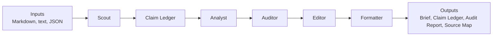

# Architecture

This project is designed like a small editorial desk for research and management briefs. One prompt can produce text, but a reliable brief needs separate responsibilities for discovery, evidence logging, analysis, audit, editing, and output.

## Core Workflow



## Agent Responsibilities

### Scout

Scout loads sources, extracts candidate reportable items, and turns them into claims. Scout is responsible for finding usable signals, not for writing the final narrative.

In the MVP, Scout reads local `.md`, `.txt`, and `.json` files. Future connectors can feed the same step from SEC filings, RSS feeds, APIs, or other public-safe inputs.

### Claim Ledger

The Claim Ledger is the control point of the workflow. Every material fact, number, date, risk, or interpretation that appears in the brief should be traceable to a claim.

This keeps the project different from a generic summarizer: the draft is not just text, it is text backed by recorded evidence.

### Analyst

Analyst drafts the brief using only Claim Ledger claims. In the MVP, this step is deterministic and writes Markdown sections with `[src:CLAIM_ID]` citations.

Future model-backed analysts should keep the same rule: if a statement matters, it needs a claim ID.

### Auditor

Auditor checks references and source support. The MVP includes deterministic audit and a public-safe quality harness. A future semantic audit adapter can compare the draft against source evidence using an LLM or local model.

For weekly briefs, deterministic audit can enforce a reporting window:

```yaml
report:
  date: "2026-06-02"
  max_source_age_days: 14
  fail_on_stale_source: true
```

Sources older than the configured window are flagged as `stale_source`; in strict mode they become high-severity findings.

The pipeline-level `AuditorAgent` delegates to an `AuditAgentInterface` backend:

```text
AuditorAgent
  -> CompositeAuditAgent
       -> DeterministicAuditAgent
       -> QualityHarnessAuditAgent
       -> optional SemanticAuditAgent
```

This separation lets the pipeline keep one stable agent step while swapping audit implementations.

### Editor

Editor improves structure, readability, and distribution polish. Editor must not invent new facts, add unsupported numbers, or hide audit failures.

### Formatter

Formatter writes output files. It should not change the substance of the brief.

Current outputs:

- `brief.md`
- `claim_ledger.json`
- `audit_report.json`
- `source_map.md`

## Migration Tracks

The following capability tracks should be implemented as clean-room, public-safe modules:

- DOCX output
- PDF output
- Feishu delivery
- Slack delivery
- Email delivery
- SEC filing connector
- RSS connector
- API connector

Each migration should include:

- A public interface
- Synthetic or public sample data
- No credentials
- Tests
- Documentation

## Current Interface-Only Modules

The repo includes interface-only migration tracks:

```text
connectors/
  sec.py
  rss.py
  api.py

delivery/
  feishu.py
  slack.py
  email.py

outputs/
  docx.py
  pdf.py
```

They are deliberately disabled or non-operational in the MVP. Real implementations should be added with public or synthetic examples only.
