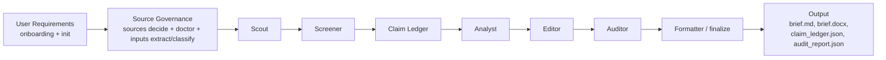

# Architecture

A subagent-first briefing workflow. The Python CLI manages workspaces, source governance, quality gates, and final rendering. AI agent runtimes coordinate role-specific subagents through handoff artifacts.

## Core Pipeline

Gray steps (source governance, finalize) run via Python CLI. White steps (Scout → Auditor) run via runtime subagents following the handoff artifact.

## Runtimes

### Claude Code (First-Class Writer Path)

Claude Code is the first-class writer / five-verb path. The `/briefloop` command exposes `new`, `run`, `status`, `feedback`, and `deliver`; `/mabw` remains a compatibility alias, and `/generate-brief` remains the delegated subagent workflow command.

### Hermes (Delegated / Scheduled Runtime Path)

Hermes uses `delegate_task` native child pipelines: scout → screener → claim-ledger → analyst → editor → auditor. Python CLI tools handle init, doctor, input extraction/classification, and finalize. Cron handles durable scheduling.

### OpenCode / Codex

`multi-agent-brief run --workspace <path> --runtime opencode|codex` generates `agent_handoff.md`, executed by platform slash commands and subagent configs.

## Input Governance

Four convention directories under `input/`:

| Directory | Role | Enters Claim Ledger? |
|---|---|---|
| `input/sources/` | Evidence files | ✅ |
| `input/feedback/` | Editorial feedback | ❌ |
| `input/instructions/` | Task requirements | ❌ |
| `input/context/` | Background reference | ❌ |

`multi-agent-brief inputs extract --config <path>` converts supported PDF/DOCX/PPTX/XLSX/image inputs to adjacent `.mineru.md` files with MinerU. `multi-agent-brief inputs classify --config <path>` then auto-classifies the original and extracted files and produces `input_classification.json`. Scout is constrained to only extract claims from `input/sources/` and `input/` root (backward compatible). Extracted Markdown under `input/context/`, `input/instructions/`, or `input/feedback/` remains non-evidence. ManualProvider blocks non-evidence directories at the code level.

## Role Responsibilities

### Scout

Reads evidence files, source packages, and search outputs. Extracts candidate reportable items into `candidate_claims.json`. Does not draft analysis.

### Screener

Filters and ranks candidates by novelty, source tier, topic caps, and historical overlap. Writes `screened_candidates.json`.

### Claim Ledger

Converts screened candidates into stable, traceable claims with unique IDs and evidence text. Writes `claim_ledger.json`. Every important statement must trace to a claim.

### Analyst

Drafts brief sections using only Claim Ledger claims. Writes `audited_brief.md` with `[src:<claim_id>]` citations. No investment advice, no invented facts.

### Editor

Improves structure, readability, and executive tone. Removes process residue (`[SRC:]` etc.), preserves valid `[src:<claim_id>]` citations. No new facts.

### Auditor

Checks citation support, source freshness, number accuracy, investment advice language, sensitive info leakage, and process residue. Delegates to `CompositeAuditAgent` (`DeterministicAuditAgent` + `QualityHarnessAuditAgent` + optional `SemanticAuditAgent`). Writes `audit_report.json`.

### Formatter / finalize

`multi-agent-brief finalize` generates reader-facing output from `audited_brief.md`, stripping `[src:<claim_id>]` markers, rendering Markdown/DOCX.

## Quality Gates

| Gate | Location |
|---|---|
| Doctor | `sources/doctor.py` |
| Inputs Classify | `cli/input_commands.py` |
| Deterministic Audit | `audit/deterministic.py` |
| Editorial Governance | `audit/editorial_governance.py` |
| Final Quality | `audit/final_quality.py` |
| Limitation Hygiene | `audit/limitation_hygiene.py` |

## Analysis Modules

| Module | Location |
|---|---|
| Market Competitor | `analysis_modules/market_competitor/` |
| Policy & Regulatory | `analysis_modules/policy_regulatory/` |

Both registered via `analysis_modules/registry.py`.

## Capability Status

| Capability | Status |
|---|---|
| Claude Code subagent workflow | Supported |
| OpenCode subagent workflow | Supported |
| Codex subagent workflow | Supported |
| Hermes adapter | Supported |
| Manual source (md/txt/json) | Supported |
| Web search (Tavily/Exa/Brave/Firecrawl/Serper) | Supported |
| RSS | Supported |
| SEC Filing resolver | Supported |
| MinerU document parsing | Experimental |
| Local signal discovery | Experimental |
| OpenCLI provider | CLI-only |
| DOCX output | Supported |
| PDF output | Experimental |
| Feishu delivery | Experimental |
| Slack delivery | Not shipped |
| Email delivery | Not shipped |
| Homebrew formula | CLI-only |
| curl installer | CLI-only |
