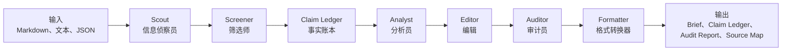

# 架构说明

这个项目可以理解成一个用于研究简报和管理层简报的小型编辑台。一个 prompt 可以生成文字，但可靠的 brief 需要把信息发现、证据记录、分析写作、事实审计、编辑和输出拆开。

## 核心流程



## 各角色职责

### Scout 信息侦察员

Scout 负责读取来源、抽取候选事项，并把它们转成 claim。Scout 的职责是发现可用信号，不负责写最终分析。

在 MVP 中，Scout 读取本地 `.md`、`.txt` 和 `.json` 文件。未来 SEC filing、RSS、API 或其他公开安全输入，都可以接入同一步。

### Screener 筛选师

Screener 按新颖度、来源层级、主题容量和历史重复情况筛选候选 claim。它和 Scout、Claim Ledger 分离，因此筛选策略可以调整，而不影响来源读取或证据存储。

### Claim Ledger 事实账本

Claim Ledger 是整个流程的控制点。简报中的重要事实、数字、日期、风险和判断，都应该能追溯到一个 claim。

这也是本项目和普通总结器的区别：草稿不是单纯的文字，而是有证据记录支撑的文字。

### Analyst 分析员

Analyst 只使用 Claim Ledger 中的 claim 来写草稿。在 MVP 中，这一步是确定性的，会生成带 `[src:CLAIM_ID]` 引用的 Markdown 章节。

未来如果接入模型写作，也应保持同一条规则：重要表述必须有 claim ID。

### Editor 编辑

Editor 改善结构、可读性和分发前表达。Editor 不能发明新事实、添加无支撑数字，也不能掩盖审计失败。

### Auditor 审计员

Auditor 检查引用和来源支撑。MVP 已经包含确定性审计和公开安全的质量门控。未来的语义审计适配器可以使用 LLM 或本地模型，把草稿和来源证据进行对照。

对于周报，确定性审计可以强制检查报告时间窗口：

```yaml
report:
  date: "2026-06-02"
  max_source_age_days: 14
  fail_on_stale_source: true
```

超过窗口的来源会被标记为 `stale_source`；在严格模式下，它会成为高严重度问题。

auditor subagent 会委托给 `AuditAgentInterface` 后端：

```text
auditor subagent
  -> CompositeAuditAgent
       -> DeterministicAuditAgent
       -> QualityHarnessAuditAgent
       -> optional SemanticAuditAgent
```

这样可以保持工作流中的审计步骤稳定，同时替换不同审计实现。

### Formatter 格式转换器

Formatter 负责写出文件，不应改变简报实质内容。

当前输出包括：

- `brief.md`：给人阅读的 Markdown，已移除内部 claim ID
- `{配置命名}.md`：可选的具名交付副本，由 `output.named_outputs` 启用
- `intermediate/audited_brief.md`：带 `[src:CLAIM_ID]` 的审计版本
- `intermediate/claim_ledger.json`
- `intermediate/audit_report.json`
- `intermediate/source_map.md`

默认文件名模板是 `{project_name}_{report_date}`，也支持 `company`、`industry`、`cadence`、`language` 等项目和报告字段。

## 迁移方向

以下能力应作为 clean-room、public-safe 模块逐步实现：

- DOCX 输出
- PDF 输出
- 飞书分发
- Slack 分发
- Email 分发
- SEC filing 连接器
- RSS 连接器
- API 连接器

每项迁移都应包含：

- 公开接口
- 合成或公开样例数据
- 不包含凭据
- 测试
- 文档

## 当前仅接口模块

仓库中已经包含以下仅接口迁移轨道：

```text
connectors/
  sec.py
  rss.py
  api.py

delivery/
  feishu.py
  slack.py
  email.py

outputs/
  docx.py
  pdf.py
```

它们在 MVP 中刻意保持禁用或未实现状态。真实实现应只使用公开或合成示例。
